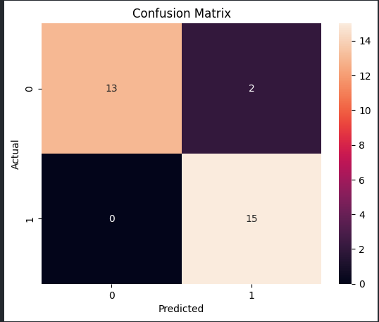

# 🫁 Pneumonia Detection — Deep Learning Pipeline

A focused deep learning project for detecting pneumonia from chest X-rays, built with an emphasis on **model reliability, error analysis, and real-world evaluation**, not just accuracy.

---

## ⚡ What this project actually does

This is a **binary image classification system** that answers:

> “Does this chest X-ray show signs of pneumonia?”

Classes:

- Normal
- Pneumonia

But more importantly:
> The system is designed to **not miss pneumonia cases**.

---

## 🧠 Why this project matters

In medical ML:

- False Positive → inconvenience  
- False Negative → **risk to life**

So this project prioritizes:
> **High Recall for Pneumonia (zero missed cases)**

---

## 🏗️ Approach (No shortcuts)

Instead of jumping to pretrained models, the pipeline was built progressively:

### 1. Custom CNN (from scratch)

- Learned feature extraction fundamentals  
- Designed multiple architectures  
- Compared depth, filters, and regularization  

### 2. Controlled Experiments

- Baseline model  
- Deeper VGG-style blocks  
- Regularization (Dropout, BatchNorm)  
- Epoch sensitivity  

### 3. Evaluation-first mindset

No “accuracy-only” thinking.

---

## 📊 Results that actually matter

### 🧪 Best Model Performance

- **Accuracy:** 93.3%  
- **Pneumonia Recall:** **1.00 (no missed cases)**  
- **ROC-AUC:** 0.98  

Confusion Matrix:



### 🔥 Key takeaway
>
> The model achieves perfect detection of pneumonia cases, with a small trade-off of false positives.

---

## ⚠️ What failed (and why it matters)

Not all models worked.

Some deeper / regularized models:

- Collapsed into predicting “Pneumonia” for most inputs  
- Achieved perfect recall but terrible specificity  

### Insight
>
> Increasing complexity **can degrade performance** if not controlled.

---

## 🧠 Architecture Philosophy

Instead of blindly stacking layers, design choices were intentional:

- Increasing filters (32 → 64 → 128 → 256)  
- GlobalAveragePooling instead of Flatten  
- BatchNorm for stability  
- Dropout to control overfitting  

Focus:
> **Efficient representation > brute force depth**

---

## 📦 Minimal Pipeline

Notebooks were avoided for final pipeline → clean modular code.

---

## 🚀 Run it locally

```bash
git clone https://github.com/your-username/pneumonia-detection.git
cd pneumonia-detection
pip install -r requirements.txt
streamlit run app.py


🧪 Evaluation Strategy

Metrics used:

Accuracy (baseline reference)
Precision (false alarms)
Recall (priority metric)
F1-score (balance)
ROC-AUC (separability)
Confusion Matrix (error visibility)
Core principle:

“If you miss pneumonia, the model has failed — regardless of accuracy.”

🧠 What I learned
Simple models can outperform complex ones
Evaluation > architecture hype
Class imbalance changes everything
Recall matters more than accuracy in critical systems
🔮 Next Steps
Transfer Learning (ResNet / EfficientNet)
Grad-CAM for explainability
Threshold tuning for precision-recall tradeoff
Larger dataset validation
👀 If you’re reviewing this

Don’t just look at accuracy.

Look at:

false negatives
model bias
decision trade-offs

That’s where the real work is.
